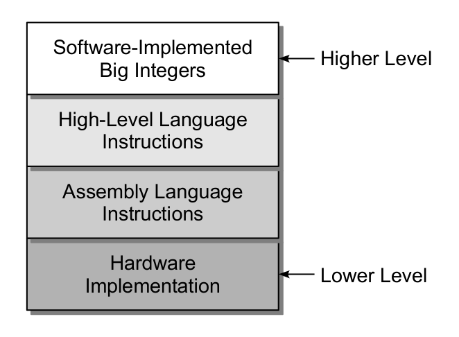
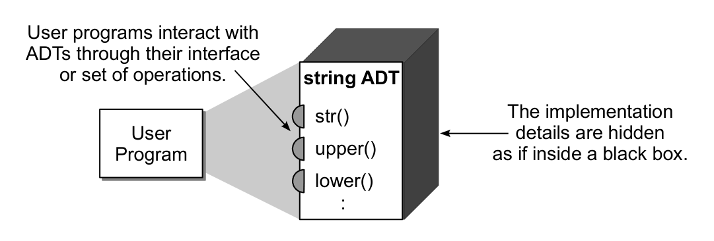
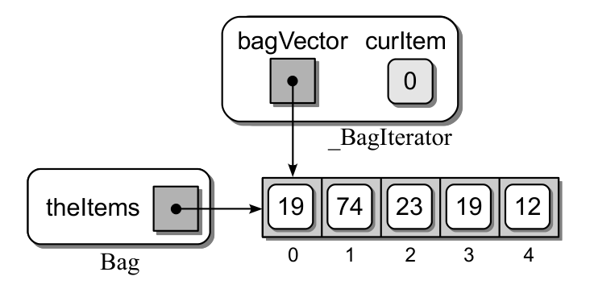

# Chapter 1 — Abstract Data Types

_Notes compiled 2026-06-21 — Rance D. Necaise, *Data Structures and Algorithms Using Python*, Ch. 1, with NotebookLM-assisted summaries (written for a first-time reader) and main-agent verification of the technical claims._

> [!tip] Companion notes in this vault
> This chapter's **Bag** is built on a Python **[List](<List Methods.md>)**; its **iterators** are the machinery that `for` loops and **[The Enumerate Function](<The Enumerate Function.md>)** rely on; and §1.2 weighs a list against a **[Dictionary](<Dictionary Methods.md>)** for storage.

---

> [!info] Chapter Essence — in one breath
> This chapter is about a single, powerful idea: **separate *what* something does from *how* it works.** An **abstract data type (ADT)** is a "black box" — you're told which operations it offers (its *interface*), but not the messy internals. A **data structure** is one particular way of building those internals. Keeping the two apart lets you use tools without understanding their wiring, and lets the wiring be swapped for something better without breaking anything that relies on it. The chapter makes this concrete with three examples: a **Date**, a **Bag**, and a small **student-records** program.

> [!tip] Never coded before? Three words to anchor everything
> - **Algorithm** — a precise, step-by-step recipe for solving a problem (like a recipe for a cake).
> - **Data type** — a *category* of data (whole numbers, text, …) bundled with the operations you're allowed to do to it (add, compare, …). It's what gives meaning to the raw 0s and 1s a computer actually stores.
> - **Abstraction** — deliberately *hiding* detail so you can focus only on what matters. You use a calculator's √ button without knowing how it computes the root — that's abstraction.

---

## 1.1 Introduction — The "What" vs. the "How"

A computer, at the bottom, only stores **0s and 1s** — and the same string of bits could mean a number, a letter, or a pixel. Meaning is layered *on top* through **abstraction**. Each layer hides the one beneath it:

> [!definition] The two central words
> - An **Abstract Data Type (ADT)** specifies a set of data values **and** the operations allowed on them — describing *what* it does while **hiding** how it does it. The approved list of operations it exposes is its **interface**.
> - A **data structure** is the concrete way the data is actually *organized and stored* inside memory — the *how*.
> - The code that makes the interface actually work, using some data structure, is the **implementation**.
> - A **client** (the book says "user program") is whatever code *uses* the ADT through its interface.

> [!tip] The analogy that makes it click — a television
> - The **ADT** is the *idea* of a TV: a box that shows moving pictures and plays sound.
> - The **interface** is the **remote control** — a fixed set of buttons: Power, Volume Up, Change Channel. *You* are the **client** pressing them.
> - The **implementation / data structure** is the wires, chips, and screen inside — the *how*.
>
> You only need the remote (interface) to know *what* the TV does. And if you buy a TV with a better screen (a new implementation), the **same remote still works** — that's exactly why separating "what" from "how" is so useful.

**Why bother separating them?** Three payoffs:
1. **Focus** — you solve your problem without drowning in internal detail.
2. **Safety** — the client can only touch the interface, so it can't accidentally corrupt the internals.
3. **Swappability** — you can replace the internal data structure with a faster one later, and no client code breaks.

> [!definition] Words for "groups of things"
> - **Collection** — a group of values with no particular organization.
> - **Container** — any ADT/structure that holds a collection.
> - **Sequence** — a container whose items sit in a strict front-to-back order (like people in a line).

---

## 1.2 The Date ADT — A First Example

The book's first ADT represents **one calendar day**. It's chosen because it's familiar, yet it shows off **encapsulation** (a synonym for *information hiding*): interact only through clean buttons; never touch the internals.

### Defining the ADT — the "remote control"

Each button is a **method** (a named operation attached to the type). A special button, the **constructor**, creates a fresh **instance** — one specific value of the type (e.g. "Oct 31 2023" is one Date *instance*; "Jan 1 2024" is a different one).

| Button (operation) | What it does |
|---|---|
| `Date(month, day, year)` | **constructor** — brings a new Date instance into existence |
| `day()` / `month()` / `year()` | report the day / month / year |
| `monthName()` | the month's name, e.g. "November" |
| `dayOfWeek()` | day of week as a number (0 = Monday … 6 = Sunday) |
| `numDays(other)` | how many days lie between this date and another |
| `isLeapYear()` | true/false — is this a leap year? |
| `advanceBy(days)` | move the date forward (or back) by some days |
| `comparable(other)` | which date comes first (lets you use `<`, `>`) |
| `toString()` | a tidy text form, e.g. "10/31/2023" |

### Using the ADT — a worked example

> [!example] "Are you at least 21?" — a digital bouncer
> **Problem.** Ask people for their birth dates and report who is at least 21 years old.
> **Setup.** Create one **target** Date via the constructor — the latest birth date that still counts as 21 (in the book's example, `June 1, 1988`). Anyone born *on or before* it is old enough.
> **Solution.** Repeatedly read a birth month/day/year, build a Date instance from it, and use `comparable` to ask: *is this birth date ≤ the target?* Keep going until the user types `0` for the month to stop.
> **Answer.** For each qualifying date the program prints "Is at least 21 years of age."
> **Insight.** The program **never** does leap-year or month-length math itself — it just presses interface buttons. It has no idea *how* a Date works inside, and doesn't need to.

### Implementing the ADT — the clever internal trick

> [!tip] How is a date actually stored?
> The obvious idea — keep month, day, year as three separate numbers — makes "days between two dates" painful (months differ in length; leap years shift everything). So the book stores each date as **one single running integer**, a **Julian day number**: the total count of days since a fixed far-past starting point.
>
> - **Days between two dates?** Just **subtract** the two integers — plain arithmetic.
> - **Which date is earlier?** Compare the two integers.
> - **Press `month()` or `year()`?** A hidden formula converts that big integer *back* into a normal calendar month/year right before answering — and the client never knows the translation happened.
>
> (Inside the implementation, the word **`self`** simply means "the specific instance I'm working on right now.")

---

## 1.3 Bags — An Unordered Collection

> [!definition] What is a Bag?
> A **Bag** is an ADT modeling a real bag of stuff (marbles, groceries): an **unordered** collection where **duplicates are allowed**. Throw in three identical red marbles and it holds all three. (Contrast a **set**, which keeps only *unique* items.)

> [!definition] A few code words, in plain English
> - **Class** — the *blueprint* a programmer writes to define a new type (the blueprint for "Bag").
> - **Instance** — one actual object built from that blueprint (the one specific bag you made).
> - **Method** — a button (operation) attached to the class.

**The Bag's buttons:** `Bag()` (make an empty bag) · `len` (count the items) · `contains` (is item X inside? true/false) · `add` (toss an item in) · `remove` (take one copy out; complains with an error if it isn't there) · `iterator` (hand out every item, one by one — see §1.4).

**Choosing the data structure.** Having decided *what* a Bag does, the book picks *how* to store it. Picture a Python **list** as a **growable row of numbered slots (cubbies)**. Between a list and a *dictionary*, the book chooses the **list**: it happily holds duplicates in separate slots without wasting memory, and gives all the room the Bag needs. (A list keeps a strict order and a bag doesn't care about order — but that mismatch is harmless.)

![Figure 1.3 — A Bag stored as a list: the internal "theItems" list holds [19, 74, 23, 19, 12] in slots 0–4 (note the repeated 19 — bags allow duplicates)](dsa_fig_1.3_bag_as_list.png)

**How the buttons work on that row of slots:**
- **add** — since order doesn't matter, just **tack a new slot onto the end** and drop the item in (fast and simple).
- **contains** — **scan** the slots one by one, checking each.
- **remove** — scan to **find** the item, pull it out, and **shift** the rest to close the gap so no empty slot is left behind.

---

## 1.4 Iterators — Visiting Every Item

> [!definition] Traversal and the problem it solves
> A **traversal** (to **iterate**) means visiting *every* item in a container, one at a time, to do something with each (search it, print it, …). But if we let outsiders reach *directly* into a Bag to look, we'd expose its hidden internals — breaking the whole point of an ADT.

> [!tip] The fix — an iterator (a conveyor belt)
> An **iterator** is a small helper built into the ADT that walks the collection *for* you without revealing the internals. Think of a **supermarket checkout belt**: instead of climbing into the stockroom, you let the belt feed items past you **one at a time**. (Or: a cursor stepping down a list.)

An iterator offers two operations:
- **Give me the next item** — return the item it's currently pointing at, then advance its placeholder by one.
- **Know when to stop** — when there's nothing left, it raises a signal called **`StopIteration`** (a formal "I'm out of items!" alarm; an *exception* is just such a signal).

> [!tip] What a `for` loop is really doing
> When you write "for each item in the bag, do …", the loop **automatically**: sets up the iterator, keeps pressing *give-me-the-next-item*, processes whatever comes back, and — the moment the `StopIteration` alarm fires — stops cleanly. You never press the buttons yourself.

Re-running the bouncer example (§1.2) is now trivial: store the birth dates in a Bag, `for` each date the belt hands out, check "born on/before the target?", and print the ones who qualify — all **without knowing how the Bag stores anything.**

---

## 1.5 Application: Student Records — Putting It Together

> [!example] The real-world task
> **Problem.** Read a collection of **student records** from an external file and print a tidy report, **sorted by ID number**. The catch: you're *not told* how the file is formatted (plain text? binary? a database?).
> **Solution — lean on abstraction.**
> - **What to store per student:** an **ID** (whole number), **first & last name** (text), a **classification code** (1–4 = freshman→senior), and a **GPA** (a decimal number, i.e. a *floating-point* value).
> - **Bundle it:** a tiny **storage class** `StudentRecord` groups those five fields under *readable names* (`firstName`, `gpa`, …). Better than an unnamed **tuple**, where you'd have to remember which slot is which.
> - **Hide the file mess:** a **Student File Reader** ADT — a *reader* is an object whose job is to pull data *in* from outside. As a black box, the main program just presses its buttons; opening files and parsing text is the reader's private business.
> **The steps.**
> 1. **Setup** — make a reader, tell it the file name (e.g. `students.txt`).
> 2. **Connect** — `open()` the file.
> 3. **Extract** — `fetchAll()`: the reader loops the file, builds a `StudentRecord` per student, and returns a ready-made **list** of them.
> 4. **Disconnect** — `close()` the file.
> 5. **Sort** — order the list by student ID.
> 6. **Report** — loop the sorted list, translate class codes (1 → "Freshman", …) into words, and print the formatted report.
> **Insight.** Every hard part (unknown file format, parsing, iterating) is sealed inside an ADT, so the top-level program reads like a short to-do list.

---

## Key Ideas & a Beginner's Glossary

- **The one big idea:** an **ADT** is the *interface* (what you can do); a **data structure** is the *implementation* (how it's built). Separating them buys focus, safety, and the freedom to swap internals.
- **Encapsulation / information hiding** — sealing internals behind an interface (the "black box").
- **Class** = blueprint · **instance/object** = one thing built from it · **method** = a button · **constructor** = the button that builds a new instance · **self** = "this particular instance."
- **Collection** = a group of values · **container** = holds a collection · **sequence** = a container in strict order.
- **Bag** = unordered collection, duplicates allowed (built here from a **list** = a growable row of numbered slots).
- **Iterator** = a helper that hands you items one at a time (a conveyor belt); a **for-loop** drives it and stops on the **StopIteration** signal.
- **Nice trick to remember:** storing a Date as **one Julian day-number** turns "days between dates" into simple subtraction — a great example of a smart data structure making operations easy.

> [!note] About the chapter's exercises
> The chapter ends with **Exercises** and **Programming Projects** — but these are hands-on *coding* assignments (finish the `Date` class, write a `printCalendar()`, build a click-counter, etc.), meant to be implemented in Python. They're a great next step *once you start coding*, but they're outside the scope of this plain-language summary, so they aren't reproduced here.

---

### Sources

| Source | Detail | Type |
|---|---|---|
| Rance D. Necaise, *Data Structures and Algorithms Using Python* | Chapter 1 — Abstract Data Types | Textbook |
| NotebookLM | Per-section summaries (prompted for a first-time reader) from the Ch. 1 PDF | LLM tool |
| Main-agent verification | Checked the ADT/data-structure claims, the Date/Bag/iterator behavior, and the Julian-day trick against the text | — |
