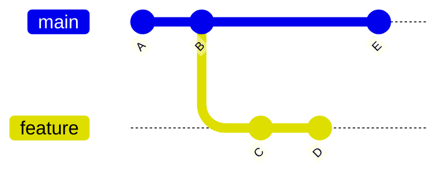
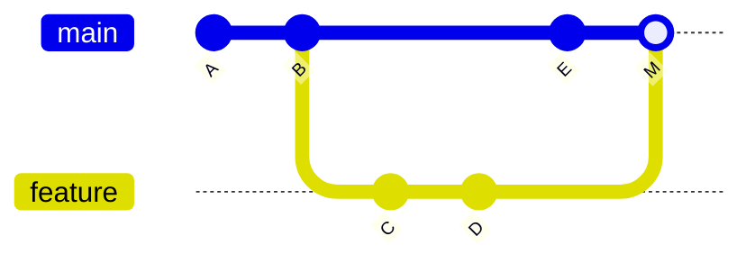
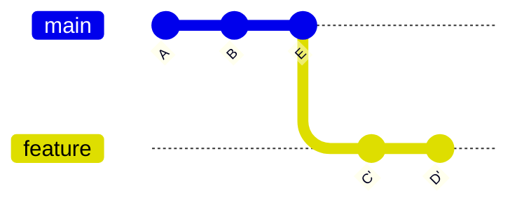
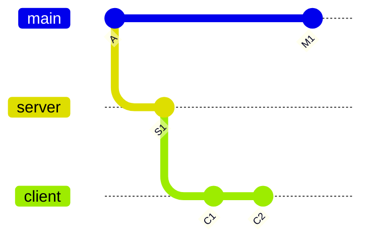
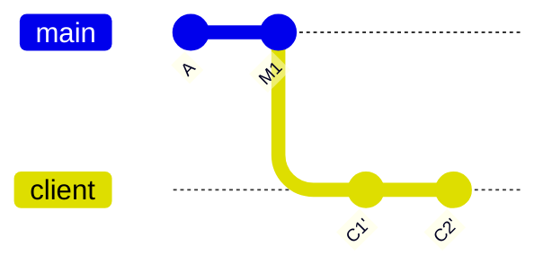

# `git rebase` — Replay Commits on a New Base

`git rebase` integrates changes from one branch into another by **rewriting history** — it takes your branch's commits, sets them aside, moves the branch to a new base, then replays the commits one by one on top. The result is code identical to what a merge would produce, but with a **linear** history instead of a merge commit.

> [!info] Rebase is surgery, merge is layering
> `git merge` stacks a new commit on top of two histories to tie them together. `git rebase` rewrites your commits as if you had started from the new base all along — the merge commit disappears, and the log reads as a single straight line.

---

## Rebase vs Merge — the Visual Difference

### Before



### After `git merge feature` (from main)



A new merge commit `M` ties the two histories together.

### After `git rebase main` (from feature)



`C` and `D` have been **replayed** onto `E` as new commits `C'` and `D'`. History is now linear — main can fast-forward to `D'`.

> [!tip] Same code, different history
> The file contents after either operation are identical. The only thing that differs is the shape of the git log.

---

## How Rebase Works — Step by Step

1. Git finds the common ancestor of your branch and the target base
2. Collects the diffs introduced by each commit on your branch since that ancestor
3. Temporarily removes those commits (saving the patches aside)
4. Resets your branch pointer to the target base
5. Reapplies each saved patch in order, creating **new commits** with new SHA-1 hashes

The old commits still exist briefly in `git reflog` — lifesaver when you need to recover.

---

## Basic Syntax

```bash
git checkout feature-x
git rebase main                    # replay feature-x's commits on top of main

# Or in one line (rebase a branch without checking it out):
git rebase main feature-x
```

After rebasing, a merge back into main becomes a clean fast-forward:

```bash
git checkout main
git merge feature-x                # fast-forward, no merge commit
```

---

## Handling Conflicts

If a replay produces a conflict, Git pauses after applying that commit:

```bash
git status                         # shows the conflicted files
# ...edit files to resolve conflicts, same markers as a merge conflict...
git add <resolved-files>
git rebase --continue              # move on to the next commit

# Bail out at any point:
git rebase --abort                 # restore branch to pre-rebase state

# Skip the current commit entirely:
git rebase --skip
```

See [[Merge Conflicts]] — the `<<<<<<<` / `=======` / `>>>>>>>` markers work identically during rebase.

---

## Interactive Rebase (`-i`)

Interactive rebase opens an editor letting you **edit, reorder, combine, or drop** commits before they're replayed. It's the standard tool for cleaning up messy local history before sharing.

```bash
git rebase -i HEAD~3               # edit the last 3 commits
git rebase -i main                 # edit every commit on feature branch since main
```

Git shows you the list in chronological order (oldest at top):

```
pick f7f3f6d Change my name a bit
pick 310154e Update README formatting
pick a5f4a0d Add cat-file

# Commands:
# p, pick   = use commit
# r, reword = use commit, edit the message
# e, edit   = stop and amend the commit
# s, squash = combine into the previous commit
# f, fixup  = like squash bt discard this commit's message
# x, exec   = run a shell command
# d, drop   = remove the commit
# b, break  = stop here (resume with 'git rebase --continue')
```

### Command Reference

| Command      | Effect                                                  |
| ------------ | ------------------------------------------------------- |
| `pick` (p)   | Use the commit unchanged                                |
| `reword` (r) | Keep the commit but edit its message                    |
| `edit` (e)   | Pause to amend content, then `git rebase --continue`    |
| `squash` (s) | Merge into previous commit, prompt for combined message |
| `fixup` (f)  | Like squash but drop this commit's message entirely     |
| `exec` (x)   | Run a shell command (e.g., tests) at this point         |
| `drop` (d)   | Delete the commit outright                              |
| `break` (b)  | Stop here so you can work manually                      |

**Reordering:** just swap the lines in the editor — Git replays them in the order shown.

---

## Common Interactive-Rebase Recipes

### Squash a noisy feature into one clean commit

```
pick  f7f3f6d Start login feature
squash 310154e WIP fix
squash a5f4a0d oops typo
```

Result: one commit with a combined message you edit.

### Edit an old commit's contents

Mark it `edit`, then when Git pauses:

```bash
# make your changes
git add <files>
git commit --amend                 # update the paused commit
git rebase --continue
```

### Split a commit into two

Mark it `edit`, then:

```bash
git reset HEAD^                    # undo the commit, keep changes unstaged
git add <first-part>
git commit -m "First logical piece"
git add <second-part>
git commit -m "Second logical piece"
git rebase --continue
```

### Run the test suite at every commit

```
pick  f7f3f6d Login feature scaffold
exec  npm test
pick  310154e Add password validation
exec  npm test
```

If `npm test` fails at any point, the rebase stops so you can fix.

### Fix a typo in one commit AND remove debug code from another (`reword` + `edit` combo)

A common cleanup combo: an old commit has a typo in its **message**, and a different old commit has a leftover debug log in its **code**. Use `reword` for the message and `edit` for the code — in one interactive-rebase session.

```bash
git rebase -i HEAD~2
```

```
reword 4a2b6e7 X: setup projct          ← typo in message text
edit   9c1d5f8 Y: add database config   ← debug log in code
```

Git processes the plan top-to-bottom:

1. **At `reword`** — editor opens with X's message. Fix the typo, save, close. Git makes a new commit X′ with the corrected message and auto-continues.
2. **At `edit`** — Git replays Y, then **pauses** at the terminal with Y as `HEAD`. You're now in a normal shell.
3. Modify the file and fold the change into Y:
   ```bash
   # remove the console.log line, save the file
   git add database.config.js
   git commit --amend --no-edit       # update Y in place, keep its message
   git rebase --continue              # resume the rebase
   ```
4. Y is rewritten as Y′ with the debug log removed. Both commits now have new hashes.

> [!tip] `reword` vs `edit` — pick the right tool
> | Want to change… | Keyword | What Git does |
> |---|---|---|
> | Just the commit **message** | `reword` (`r`) | Pauses, opens editor for the message only, you save, Git auto-continues |
> | The actual **code** in the commit | `edit` (`e`) | Pauses with that commit checked out; you modify files, then `git commit --amend` + `git rebase --continue` |
>
> `edit` can technically do everything `reword` can (since `commit --amend` opens the message editor too), but `reword` is the cleaner, less-error-prone choice when **only** the message needs work.

---

## Advanced — `--onto` for Branch Transplants

When you have a topic branch off a topic branch and want to move it, `--onto` lets you replay commits onto any base, regardless of the branch's history.



Say `client` should actually branch off `main`, skipping `server`:

```bash
git rebase --onto main server client
```

Reads as: *take the commits on `client` that came after `server`, and replay them onto `main`.*

Result:



---

## ⚠ The Golden Rule

> [!warning] Never rebase commits that have been pushed to a public/shared branch
> Rebasing replaces commits with new ones that have **different SHA-1 hashes**. Anyone who already has the old commits sees the history "vanish" and will create duplicates when they try to sync. On shared branches (`main`, `develop`, release branches), this wrecks everyone's history.
>
> **Rule of thumb:** rebase is safe only on commits that exist nowhere but your machine.

> [!example] 📂 Open the visual walkthrough
> A full step-by-step disaster scenario — color-coded commit diagrams, three failure modes, and the cost/benefit asymmetry that makes this rule absolute:
> 
>
> 👉 **[Open: Git Rebase Disaster Walkthrough](git%20rebase%20disaster%20walkthrough.html)**  , [golden_rule_violation.html](file:///C:/Users/dwan0/Downloads/golden_rule_violation.html)
>
> The HTML file lives next to this note in the `Branching/` folder. Clicking opens it in your default browser.

### What goes wrong — the short version

The trigger is small: fix a typo, remove a debug log. You rebase locally, force-push, and the remote's X / Y become X′ / Y′ — same content, **new hashes**.

| Failure mode | Who | What happens |
|---|---|---|
| **Phantom conflicts** | Bob, on `git pull` | Git merges two timelines of nearly identical code, producing conflicts on every line that differs even slightly |
| **Stranded feature branch** | Bob's `bob/login` | Anchored to orphan Y; rebasing onto Y′ produces more conflicts |
| **Silent rollback** | Carol, force-pushing back | Carol force-pushes her stale tip, **erasing X′ and Y′ from the remote entirely** |

Why the rule is **absolute**, not "use caution":

| Cost / Benefit | Magnitude |
|---|---|
| Benefit of rebasing shared history | Marginal (slightly cleaner messages) |
| Cost when it goes wrong | Hours of teammate confusion + potential lost work |
| Failure visibility on **your** machine | **Zero** — push and everything looks fine |
| Failure visibility on others' machines | Hours later, scattered across the team |

That asymmetry — *invisible to you, expensive to them* — is why this is stated as an absolute rule. Git uses hashes (not content) to identify commits. Once a commit is shared, **its hash is its identity** — change the identity, and every reference to it elsewhere breaks.

### Acceptable force-push scenarios

When rebasing a private feature branch you pushed only for backup, a force-push is OK — **if no one else has fetched it yet.** Prefer `--force-with-lease` for safety:

```bash
git push --force-with-lease origin feature-x
```

This aborts the push if anyone else's commits have landed on the remote branch since your last fetch. See [[git push]] for why it's safer than plain `--force`.

---

## Rebase vs Merge — Choosing

| Situation | Prefer |
|---|---|
| Private/local cleanup before sharing | **Rebase** |
| Catching up a feature branch with recent `main` | **Rebase** (or `git pull --rebase`) |
| Integrating a completed feature into `main` | Either — team preference |
| Anything already pushed and reviewed by others | **Merge** |
| Preserving the exact historical record | **Merge** |
| Clean linear log for `git bisect` and blame | **Rebase** |

The common hybrid: **rebase locally** to polish history, **merge publicly** once the branch is clean.

---

## `git pull --rebase`

Instead of the default `pull = fetch + merge`, this does `fetch + rebase`:

```bash
git pull --rebase origin main
```

Your local commits are replayed on top of the incoming ones — no merge commit, linear history. See [[git pull]] for setting this as the default globally.

---

## Recovering from a Bad Rebase

Rebases move commits rather than destroying them. The original tips live in the reflog for ~90 days.

```bash
git reflog                         # shows HEAD's history
# e.g.:
# ffe9411 HEAD@{0}: rebase finished
# 7b3474b HEAD@{1}: rebase start
# abc1234 HEAD@{2}: commit: Pre-rebase state

git reset --hard HEAD@{2}          # jump back to the pre-rebase state
```

---

## Typical End-to-End Workflow

```bash
# Start a feature
git checkout -b feature-login main

# ...make messy commits while developing...
git commit -am "wip"
git commit -am "more wip"
git commit -am "oops typo fix"

# Before sharing, clean up
git rebase -i main                 # squash, reword, reorder

# Catch up with latest main
git fetch origin
git rebase origin/main             # replay on top of updated main

# Merge as a fast-forward
git checkout main
git merge feature-login            # no merge commit needed
git push origin main
git branch -d feature-login
```

---

## See Also

- [[Branching (Main)]] — overview of branches
- [[git merge]] — the non-rewriting alternative
- [[git cherry-pick]] — replay single commits instead of a whole branch
- [[Squashing Commits]] — `rebase -i` is one way; compared with `merge --squash` and `reset --soft`
- [[Merge Conflicts]] — conflicts during rebase resolve the same way
- [[git pull]] — `pull --rebase` for the sync use case
- [[git push]] — why `--force-with-lease` is safer than `--force` after a rebase
- [[Git Essential Commands]] — quick-reference
